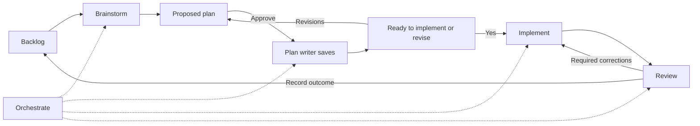

# Workflow Loop

Six skills and three companion agents for one continuous project conversation.
Start with `$workflow-loop:brainstorm`, let Codex select it when exploration fits,
or use `$workflow-loop:orchestrate` to enter at the stage your task needs.



Brainstorm through the goal, tradeoffs, and evidence. When the direction is clear,
Codex presents a concrete proposed plan and asks how it looks. Reply `y`, `yes`,
or `approved` to have the plan writer write it automatically. Codex then links
the saved plan and asks whether you are ready for implementation or want revisions.
Your next affirmative starts implementation, validation, independent review, and
any required corrections in the same conversation.

Approval applies to the proposal just presented. “Yes, but change X” requests a
revision; it does not start work on the old proposal. The readiness question is
the final planned revision checkpoint, and you can still steer work afterward.
“Approved, write it and implement” authorizes both transitions at once.

Existing build authorization carries forward without repeated permission prompts.
Explicit “brainstorm only,” “plan only,” “review only,” and “keep it in chat” limits
take precedence. Small settled edits can skip discovery and formal planning.

| Skill | Responsibility | Conversation or worker |
| --- | --- | --- |
| [orchestrate](skills/orchestrate/SKILL.md) | Route stages, preserve decisions, coordinate corrections | Main conversation |
| [backlog](skills/backlog/SKILL.md) | Capture and maintain issues, evidence, status, and artifact links | Main conversation |
| [brainstorm](skills/brainstorm/SKILL.md) | Explore needs and alternatives; present a proposal for approval | Main conversation |
| [plan](skills/plan/SKILL.md) | Write the detailed plan and its acceptance criteria | `planner` |
| [implement](skills/implement/SKILL.md) | Execute requirements and report validation evidence | `implementer` |
| [review](skills/review/SKILL.md) | Independently assess changes and verify corrections | `reviewer` |

Stage workers return to the orchestrator. The orchestrator keeps user dialogue
in the main conversation and sends review findings back through implementation
and review until the authorized work is complete or a concrete blocker remains.

The [shared harness](HARNESS.md) keeps approval, collaboration, and quality rules
in one place. Stage skills supply the relevant procedure: inspect before asking,
research consequential unknowns, plan observable outcomes, validate behavior, and
review actual changes. Load only what the task needs; no separate workflow service
or state database is required.

## Optional Claude collaboration

When Claudex is available, Codex consults Claude by default for complicated physics
or logic and uses discretion for other difficult work. Codex stays in charge of
decisions, integration, and verification. Workers route consultation requests
through the lead to avoid duplicate calls.

Claudex is an optional enhancement. The plugin declares no Claude tool, login, or
installation dependency. If the bridge is missing, unavailable, or limited, Codex
briefly reports the limitation and continues. “Codex only” disables consultation.

## Install

From the marketplace repository root:

```sh
codex plugin marketplace add .
codex plugin add workflow-loop@codex-plugins
```

Start a new Codex session. Select the Workflow Loop skill in the skills picker
or explicitly ask to use it. In the installed catalog its skills are namespaced
as `workflow-loop:orchestrate`, `workflow-loop:backlog`, and so on.

Example requests:

- “$workflow-loop:brainstorm — help me explore this idea.”
- “$workflow-loop:orchestrate — implement this backlog item and review the result.”
- “$workflow-loop:brainstorm — explore this idea; stop after the brief.”
- “$workflow-loop:review — assess these changes.”

## Companion agents

The plugin includes [planner](agents/planner.toml),
[implementer](agents/implementer.toml), and [reviewer](agents/reviewer.toml).
Their instructions preserve the original stage responsibilities and resolve
skills from this plugin through the parent's exact path or the installed catalog.
Model, reasoning, and permission settings inherit from the parent.

Codex documents native custom roles in `~/.codex/agents/` or project-local
`.codex/agents/`. The plugin manifest schema used by this repository does not
accept an `agents` field. Bundling these TOML files therefore does not promise
automatic native role registration. The orchestrator reads the bundled files
and supplies their instructions to generic subagents when named roles are
unavailable. This works without an additional setup step when subagents are
available. If delegation is unavailable, the skill discloses that limitation;
self-review does not satisfy an independent-review requirement.

To register the native roles as well, use Python 3.11+ from the repository root:

```sh
python3 plugins/workflow-loop/scripts/install_agents.py --dry-run
python3 plugins/workflow-loop/scripts/install_agents.py
```

The helper honors `CODEX_HOME`, otherwise using `~/.codex/agents`. Use
`--agents-dir /path/to/project/.codex/agents` for project scope. Identical files
are left alone. If any existing role differs, the helper refuses the whole
installation before writing; `--replace` explicitly backs up differing files
with unique `.bak` filenames and replaces them. Start a new session afterward.
Install the plugin before using the native roles so their stage skills are
available in the catalog.

## Package contents and maintenance

```text
.codex-plugin/plugin.json
HARNESS.md
skills/{backlog,brainstorm,orchestrate,plan,implement,review}/
  SKILL.md
  agents/openai.yaml
agents/{planner,implementer,reviewer}.toml
scripts/install_agents.py
```

The `agents/openai.yaml` inside each skill supplies skill display metadata;
the TOML files at the plugin root define the three stage workers.

The plugin owns its skill and agent copies; it does not modify personal skills.
Maintain the shared harness and six skills together, preserving relative links. Default
project artifacts remain `docs/backlog.md`, `docs/briefs/<topic>-001.md`, and
`docs/plans/{nnn}-{slug}.md`, following each skill's existing conventions and
migration rules. They belong to the project being worked on.

## References

- [OpenAI plugin packaging and marketplaces](https://developers.openai.com/plugins/build/plugins)
- [OpenAI custom subagent configuration](https://learn.chatgpt.com/docs/agent-configuration/subagents)
