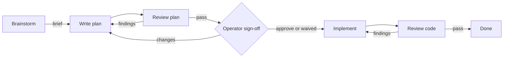

# Workflow

A small software team for one request. The orchestrator routes discovery,
planning, implementation, and independent review of both the plan and the code.
This is the Codex port of
[Claude Workflow](https://github.com/astrosteveo/claude-plugins/tree/main/plugins/workflow),
ported from version `0.1.0`, commit `118e410228ff4b6657560842a01ec1ec7f45c1b9`.
The Claude plugin is maintained separately and was not changed by this migration.



Start with `$workflow:orchestrate <request>`. "Plan this" stops at the reviewed
plan; "review this branch" stops at findings; "build this" runs the delivery
loop. Unclear goals begin with discovery. A small settled fix skips planning
but still gets an independent code review.

| Skill | Purpose | Runs in |
| --- | --- | --- |
| [orchestrate](skills/orchestrate/SKILL.md) | Route stages, handle sign-off, drive correction loops | Main conversation |
| [brainstorm](skills/brainstorm/SKILL.md) | Explore an idea and save a discovery brief | Main conversation |
| [writing-plans](skills/writing-plans/SKILL.md) | Write a self-contained implementation plan | Planner subagent |
| [implement](skills/implement/SKILL.md) | Execute the plan and validate behavior | Implementer subagent |
| [review](skills/review/SKILL.md) | Independently assess plans or code against requirements | Reviewer subagent |

The orchestrator delegates one dependent stage at a time. Review findings go
back to the author, and the reviewer rechecks the corrections. It asks for
sign-off on the reviewed plan unless approval already covers the scope or you
waived the gate, for example by saying "don't stop for approval". It returns
to you when progress needs a product decision, a disputed finding remains, or
a dependency is unavailable.

## Install

From the Codex marketplace repository root:

```sh
codex plugin marketplace add .
codex plugin add workflow@codex-plugins
```

Start a new Codex session after installation.

## Usage

```text
$workflow:orchestrate Add rate limiting to the public API.
$workflow:orchestrate I want to do something with analytics but I'm not sure what.
$workflow:orchestrate Plan this, don't implement: migrate sessions to Postgres.
$workflow:orchestrate Review the changes on this branch.
$workflow:orchestrate Plan: /abs/path/docs/plans/003-rate-limiting.md
$workflow:orchestrate Brief: /abs/path/docs/briefs/002-rate-limiting.md
```

Each stage also works directly: `$workflow:brainstorm`,
`$workflow:writing-plans`, `$workflow:implement`, and `$workflow:review`.
A directly invoked stage does its own job and stops; it does not arrange
subsequent reviews. A plan written directly remains unreviewed until it is
handed to the orchestrator.

## Companion agents

The plugin bundles `workflow-planner`, `workflow-implementer`, and
`workflow-reviewer` in [agents/](agents/). Each definition tells the worker to
read its stage skill using the absolute path provided by the orchestrator.
Plugin installation does not install these companion files as native roles;
the orchestrator can pass their instructions to general-purpose subagents.

For native roles, run the optional installer with Python 3.11 or later from
the marketplace repository root:

```sh
python3 plugins/workflow/scripts/install_agents.py --dry-run
python3 plugins/workflow/scripts/install_agents.py
```

It installs into `$CODEX_HOME/agents`, or `~/.codex/agents` when unset. Use
`--agents-dir /path/to/project/.codex/agents` for project-scoped roles. It
leaves identical files alone and refuses differing files unless `--replace`
is supplied, which backs up the originals first. Start a new session after
installing roles. The prefixed names avoid overwriting generic planner,
implementer, or reviewer definitions.

The reviewer requests `sandbox_mode = "read-only"`. Live parent permission
overrides can take precedence, and passing instructions to a generic subagent
does not apply TOML sandbox settings. In every mode the reviewer is instructed
not to edit the reviewed files, including through shell commands. Checks that
cannot run under the active permissions are reported as not run. Model and
reasoning settings inherit from the parent. See the
[official custom-agent documentation](https://learn.chatgpt.com/docs/agent-configuration/subagents).

If subagents are unavailable, authorized stage work can continue locally, but
self-review does not satisfy an independent review gate. The orchestrator
reports that missing review and cannot mark the whole workflow complete.

## Artifacts

Follow the project conventions; otherwise save briefs to
`docs/briefs/NNN-slug.md` and plans to `docs/plans/NNN-slug.md`, numbered from
`001` across each directory. Artifacts belong to the project being worked on.
A trivial fix needs neither a brief nor a plan.

Plans record `Review` and `Approval` status plus implementation progress.
`$workflow:orchestrate Plan: <absolute path>` resumes at the appropriate stage.
No stage forces a new session.

## Replacing workflow-loop

`workflow-loop` has been removed from this marketplace. For an existing local
installation, register this checkout and switch plugins:

```sh
codex plugin marketplace add .
codex plugin remove workflow-loop@codex-plugins
codex plugin add workflow@codex-plugins
```

Skip the removal command on a fresh installation. Start a new session and use
`$workflow:orchestrate`. The former `$workflow-loop:plan` becomes
`$workflow:writing-plans`; the other shared stage names retain their suffixes.
The old backlog skill is not part of the five-skill Claude workflow being
ported. Existing project briefs, plans, and backlog files remain project data;
older plans without review/approval status need that status established from
evidence before resuming. This plugin does not depend on the retired harness.

Previously installed generic `planner.toml`, `implementer.toml`, and
`reviewer.toml` are not removed by this plugin's installer. If you installed
them for Workflow Loop, remove only those old definitions after checking that
they have not been customized or reused elsewhere.

## Contents

```text
.codex-plugin/plugin.json
skills/{orchestrate,brainstorm,writing-plans,implement,review}/SKILL.md
skills/<skill>/agents/openai.yaml
agents/workflow-{planner,implementer,reviewer}.toml
scripts/install_agents.py
```
